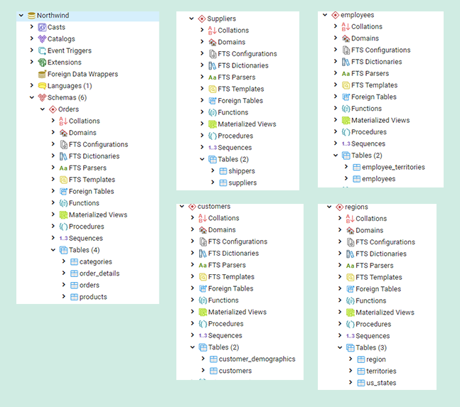

## Welcome!

## Business Analyst

   Experienced in performing detailed requirements analysis, documenting processes, leading projects comprised of both technical and non-technical users.
  
## Master Data Analyst 

 Knowledgable in SQL, Python, SAS Studio, R, advanced Excel, MS Access certified. Analytical thinker with the ability to grasp complex challenges.
  
## Northwind Data Mining and Statistical Analysis
 
 The scripts for this project can be found here: [Northwind_DataMining_StatisticalAnalysis](https://github.com/AKEMMONS2/Northwind_DataMining_StatisticalAnalysis.git).
 
   Data mining is the process of taking a raw, large set of data and extracting usable data from it (The Economic Times, n.d.). To determine if the data is usable, it is evaluated for anomalies, patterns and correlations which are then used to predict outcomes. The Northwind data set contains sales data, it will be analyzed, and the following questions will be the groundwork for the statistical analysis.  Which product category produces the highest profitability? What countries purchase the most products? 

The Northwind Database was created and populated in PostgreSQL. Below are the screenshots by author of the database schemas and fact and dimension tables from the PostgreSQL database. 

Five schemas

Fact & Dimension Table
 
 
  Part of the mining process is determining if the data you are using is suitable. Is the data structured? Structured data has columns and rows such as in Excel, CSV or a text file. “The less ETL (extraction, transformation and loading) an organization has to do before analysis, the faster it can start generating insights” (IDG Communications, Inc., 2020). The Northwind data set is structured, allowing us to move to the next step. 

Statistical analysis consists of two main types: descriptive and inference statistics. Descriptive statistics is intended to summarize data with charts and tables, allowing one to get a better understanding of the data set (Brooks, 2014). 

The above table represents the Northwind data product categories analyzing the profit and loss for each product category over three years. Meat/Poultry on average has the greatest profitability of 39.19, while seafood averages the least profitability at 10.44 over the years, followed closely by Grains/Cereals. 

The summary statistic above represents the Northwind data products purchased by the country analyzing the quantity sold over three years. Austria purchased 41 products, while Norway averaged the least amount of purchases in a year with 10 purchases. 

References
IDG Communications, Inc. (2020). Creating data ecosystems and the requirements for a successful data exchange. Retrieved 05 08, 2020, from CIO: https://www.cio.com/article/3530335/creating-data-ecosystems-and-the-requirements-for-a-successful-data-exchange.html

SAS Institute Inc. (2018). localhost:10080. Retrieved from SAS Studio: http://localhost:10080/SASStudio/38/main?locale=en_US&zone=GMT-05%253A00&http%3A%2F%2Flocalhost%3A10080%2FSASStudio%2F38%2F=

The Economic Times. (n.d.). Definition of data mining. Retrieved 05 08, 2020, from The Economic Times: https://economictimes.indiatimes.com/definition/data-mining

## Business Communication

### Using Style in Business Communication
 
   Business communication is sometimes portrayed as boring or bland. There are many sources discussing style and how to write corporate documents, but why is choosing a style important? Which style guide works best for business communication? Following instructions can be the key to getting a difficult task done and choosing the proper writing style is important. Seven basic qualities that characterize good business writing include:

- Understanding the audience
- Following basic writing guidelines 
- Making it easy to read 
- It should attract the reader and meet the reader’s expectations
- The writing should be clear and concise
- It should efficiently and effectively solve the reader’s problems  (Creative Commons license, 2010)

The above steps are necessary to successfully communicate in business, but they are just the beginning. To achieve effective business communication, planning and thought are necessary, but you cannot stop there. Technical documents like other business communication need to be updated and revised. Especially when there are changes to the procedure, software, or other factors that have an impact or every two years. 

### The Basics of Style

   The main goal in considering style is to present your information in a manner appropriate for both the audience and the purpose of the writing." (Wheaton College Writing Center, 2019) Style isn't ala carte, many things should accompany it; 
- Active voice
- Tone - appropriate to the document
- Concise language – reader-focused that is sensitive to the reader’s culture and language
- Simple descriptions - avoid redundant pairs
- Most importantly, style can only be selected after the audience is analyzed. 

### Why Style

   Why is style important in business communication? It can become costly if ignored, ask Rogers Communications, Inc. Not only is style important while writing, but reading it correctly is extremely important. “The validity of the contract and the millions of dollars at stake all came down to one point - the second comma in the sentence” (Robertson, 2018). When reviewing a contract, Rogers Communications, Inc. and their lawyers missed a comma, which resulted in not being able to cancel their contract before five years, this resulted in an additional 2.13 million dollars being spent. Style is important and it can reflect on the organization itself, “81% of people surveyed by Harvard Business review agree that poorly written material wastes a lot of their time”. (Bernoff, 2016) When processes are not documented properly and business documentation is unorganized, filled with jargon, or too lengthy. It slows down productivity and tends to leave a negative impact on the organization, employees, and even customers. On the other hand, clarity instills trust, alignment, and boosts productivity. 

### Over and Undercompensating

   When style is not added to technical documentation, it causes the document to feel cold and appear impersonal. Some prefer contrasting colors to “liven” up a document, which is seen as unprofessional to others. It is possible to have too much or too little of a good thing. Good content with bad style is the worst, but with a positive attitude and ingenuity to add, boring writing can become great.  “We’ve all read (and perhaps written) a boring document: the robot-like language, the walls of text.” (Moses, 2018) Jacob Moses a technical writer has created a podcast called the not boring technical writer; the podcast provides tools to help enhance writing skills. So, although there is boring technical documentation out there, it does not have to be the norm. Great writing can result in keeping the audience captivated long enough to convey the message and hopefully inspire them.	

### Conclusion

   The style in business communication is not only a good idea, but in the end, it can be cost saving. Employees that see and use proper business communication are more likely to notice if there is an extra comma vs an organization that rarely practices good communication. Properly documented technical documentation creates a positive environment filled with trust and productivity. Whether a predesigned style guide or the basic guidelines are used, style should be incorporated in all technical writing with consistency that is appropriate based on audience and document purpose.  

References

Bernoff, J. (2016, Sep 06). Bad writing is destroying your company's productivity. Retrieved from Harvard Business: https://hbr.org/2016/09/bad-writing-is-destroying-your-companys-productivity

Creative Commons license. (2010). Style in written communication. In unknown, Business communication for success (p. 4.4). University of Minnesota Libraries Publishing.

Moses, J. (2018). The not-boriing tech writer. Retrieved from The not-boriing tech writer: https://www.thenotboringtechwriter.com/

Robertson, G. (2018, Apr 6). Comma quirk irks Rogers. Retrieved from The Globe and Mail Inc.: https://www.theglobeandmail.com/report-on-business/comma-quirk-irks-rogers/article1101686/

Wheaton College Writing Center. (2019). Style, diction, tone, and voice. Retrieved from Wheaton College: https://www.wheaton.edu/academics/services/writing-center/writing-resources/style-diction-tone-and-voice/

